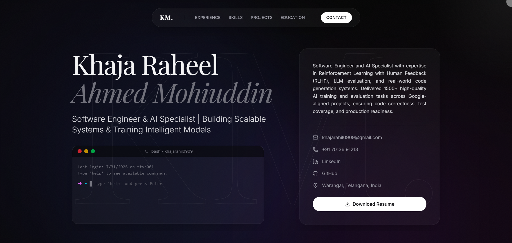

# Khaja Raheel Ahmed Mohiuddin — Portfolio

A modern, interactive portfolio showcasing my work as a **Prompt Engineer & LLM Specialist** — adversarial evaluation, red-teaming, RLHF, and RAG systems.

[](LICENSE)
[](https://react.dev/)
[](https://www.typescriptlang.org/)
[](https://vite.dev/)
[](https://khajaraheel.vercel.app)

**Live site:** [khajaraheel.vercel.app](https://khajaraheel.vercel.app)



## Highlights

- **Interactive terminal** in the hero — type `help` and ask questions about my experience, skills, and projects
- **Editorial design** — glassmorphism panels, animated gradient background, custom cursor, 3D tilt cards
- **Smooth scrolling** powered by Lenis, with scroll-driven parallax and staggered section reveals
- **Accessible** — respects `prefers-reduced-motion`, semantic markup, ARIA labels
- **Performant** — reduced GPU load on mobile, preloaded assets, ~123 kB gzipped JS
- **SEO-ready** — Open Graph and Twitter meta tags for clean social sharing

## Tech Stack

| Category  | Tools                                       |
| --------- | ------------------------------------------- |
| Framework | React 19, TypeScript                        |
| Build     | Vite 6                                      |
| Styling   | Tailwind CSS v4                             |
| Animation | Motion (Framer Motion), Lenis smooth scroll |
| Icons     | Lucide React                                |
| Hosting   | Vercel                                      |

## Getting Started

```bash
# Clone the repository
git clone https://github.com/KhajaRaheelAhmedMohiuddin/Portfolio.git
cd Portfolio

# Install dependencies
npm install

# Start the dev server
npm run dev
```

Open [http://localhost:3000](http://localhost:3000) in your browser.

### Other commands

```bash
npm run build     # Production build (outputs to dist/)
npm run preview   # Preview the production build locally
npm run lint      # Type-check with TypeScript
```

## Project Structure

```
├── docs/              # README screenshots
├── public/            # Static assets (resume, logos, favicon)
├── src/
│   ├── components/    # UI components (Hero, Experience, Skills, Projects, ...)
│   ├── data.ts        # Single source of truth for resume content
│   ├── App.tsx        # Layout, smooth scroll & motion configuration
│   └── index.css      # Theme tokens & global styles
└── index.html         # Entry point with SEO meta tags
```

All resume content lives in `src/data.ts` — update it in one place and the entire site stays consistent.

## Deployment

Hosted on [Vercel](https://vercel.com). Every push to `main` triggers an automatic production deployment.

## Contact

- **Email:** [khajarahil0909@gmail.com](mailto:khajarahil0909@gmail.com)
- **LinkedIn:** [khajaraheelahmedmohiuddin](https://www.linkedin.com/in/khajaraheelahmedmohiuddin/)
- **GitHub:** [KhajaRaheelAhmedMohiuddin](https://github.com/KhajaRaheelAhmedMohiuddin)

## License

Released under the [MIT License](LICENSE) © 2026 Khaja Raheel Ahmed Mohiuddin.
